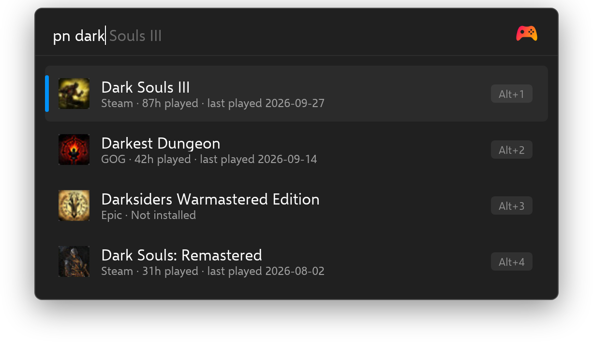
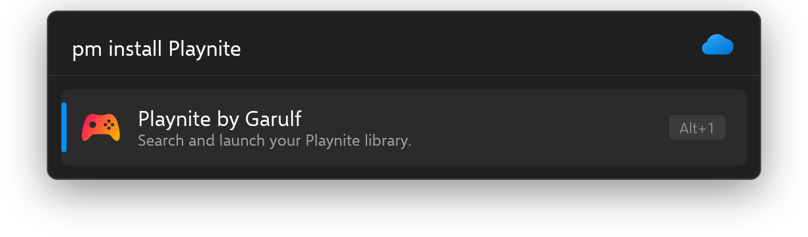

<!-- generated by readwright from docs/README.md.j2; edit the template, not this file -->
# Playnite

Search and launch your Playnite library. Fully local, no Playnite extension required.

[](https://github.com/Garulf/Playnite-Plugin/actions/workflows/tests.yml) [](https://github.com/Garulf/Playnite-Plugin/releases/latest) [](https://github.com/Garulf/Playnite-Plugin/blob/main/LICENSE)

[](https://www.buymeacoffee.com/garulf) [](https://github.com/sponsors/Garulf)

## Features

* **Works out of the box.** Reads `games.db` directly with litedb-py, no Playnite extension required.
* **Live results, optionally.** Pair it with the [playnite-library-server](https://github.com/Garulf/playnite-library-server) extension for live library data while Playnite runs.
* **Fully local.** No cloud services, no API keys.
* **Fuzzy matching.** `pn rdr2` will match Red Dead Redemption 2.
* **Icons and cover art.** Game icons in results, cover art on `F1`.
* **All your sources.** Every library Playnite knows about, in one search.
* **Launch or open.** Installed games launch directly; uninstalled games open their Playnite page.
* **Rich context menu.** Open install folder, jump to store links, copy the game id.
* **Hidden games, opt-in.** Include games hidden in Playnite via a setting.

## Usage

Type `pn` followed by a game name:

```
pn dark
```



## Installation

### Flow Launcher

In Flow Launcher, type:

```
pm install playnite
```



### Manual installation

Download `Playnite-Plugin-<version>.zip` from the [latest release](https://github.com/Garulf/Playnite-Plugin/releases/latest) and unzip it into
`%appdata%\FlowLauncher\Plugins`, then restart Flow Launcher.

## Live library data (optional)

By default the plugin reads `games.db` directly, which is a snapshot that can go stale while
Playnite is running (install status, newly added games, artwork). Installing the companion
[playnite-library-server](https://github.com/Garulf/playnite-library-server) Playnite extension
lets the plugin pull live data from Playnite instead, including artwork, whenever it's running.
If the extension isn't installed, or the request fails for any reason, the plugin falls back to
reading `games.db` as before, no configuration needed.

To set it up, download `PlayniteLibraryServer_<version>.pext` from the extension's
[latest release](https://github.com/Garulf/playnite-library-server/releases/latest), open it with
Playnite (or drag it onto the Playnite window), and restart Playnite.

If you've changed the extension's port from its default (`38217`), set it in the plugin's
settings via `library_server_port`.

## Changelog

### [3.1.0](https://github.com/Garulf/Playnite-Plugin/compare/v3.0.0...v3.1.0) (2026-08-30)

#### Features

* add Game.from_json_api for the live library server response ([981bef2](https://github.com/Garulf/Playnite-Plugin/commit/981bef2a2b59b139f8799d3726a2b1a087b9bcb3))
* add HTTP client for the live library server ([a2a85c4](https://github.com/Garulf/Playnite-Plugin/commit/a2a85c468d329115bffef3706e6f2bf1ff0171bd))
* fall back to the file-based library when the server is unavailable ([d338730](https://github.com/Garulf/Playnite-Plugin/commit/d338730c74a4cd4b5460cdd07623f52f72912279))
* query the live library server before falling back to games.db ([bae8b10](https://github.com/Garulf/Playnite-Plugin/commit/bae8b104bad138c64362e726ac7e72a75b9024c7))

#### Bug Fixes

* bump pyflowlauncher to 1.1.1 ([#51](https://github.com/Garulf/Playnite-Plugin/issues/51)) ([abd849c](https://github.com/Garulf/Playnite-Plugin/commit/abd849cc44f37cec416626d9a357d22f2078cb05))
* bump pyflowlauncher to 1.1.2 so builtin result actions dispatch ([6b2544b](https://github.com/Garulf/Playnite-Plugin/commit/6b2544bc0004bb886ae9c7cc69bbdc5a02668dbf))
* harden the live-server path against malformed responses ([3d9f49e](https://github.com/Garulf/Playnite-Plugin/commit/3d9f49e7bbe07778cc11cb5638fa9a613597e2cd))
* serve last cached library snapshot when Playnite locks games.db ([2b902ee](https://github.com/Garulf/Playnite-Plugin/commit/2b902eee55a22aaf43bc554a2deff4cb145a59fa))

#### Documentation

* document the live library server integration ([4623c73](https://github.com/Garulf/Playnite-Plugin/commit/4623c73ee0ac5dda14c8b80769e60068ba054e26))

### [3.0.0](https://github.com/Garulf/Playnite-Plugin/compare/v2.0.0...v3.0.0) (2026-08-25)

#### ⚠ BREAKING CHANGES

* scaffold python_v2 plugin layout, drop FlowLauncherExporter dependency

#### Features

* add Game model, playnite URIs, and subtitle formatting ([5f5344c](https://github.com/Garulf/Playnite-Plugin/commit/5f5344c7bfd7df2842ddffe6e04bcedf23b88b3f))
* build query results and rich conditional context menu ([453d20a](https://github.com/Garulf/Playnite-Plugin/commit/453d20a3578d401f68cdd1675d864602af0fc8ca))
* locate Playnite library and cache a lock-free copy of games.db ([cdaa9f7](https://github.com/Garulf/Playnite-Plugin/commit/cdaa9f7b86a57b0a6edffff51420e7b902b0fc94))
* read games and source names from the Playnite database ([4850b7e](https://github.com/Garulf/Playnite-Plugin/commit/4850b7e8bd755ebef32f213b7abb21bd0143ec80))
* scaffold python_v2 plugin layout, drop FlowLauncherExporter dependency ([c55e2f8](https://github.com/Garulf/Playnite-Plugin/commit/c55e2f8b4a850b8eb1eccef92bab3e42d71605c4))
* wire query and context menu into pyflowlauncher plugin ([2bdac65](https://github.com/Garulf/Playnite-Plugin/commit/2bdac65099ea36f383f19b2c976596744605e049))

#### Bug Fixes

* hide the install folder entry when the directory is missing ([456d8bb](https://github.com/Garulf/Playnite-Plugin/commit/456d8bb8dbd3a4a8ea7b4227b263daa59f86caf8))
* replace em dash in run.py comment ([7b1a912](https://github.com/Garulf/Playnite-Plugin/commit/7b1a912bb6bf56a7b02abe0fa3bc24e52a6dfff8))
* report an unreadable Playnite library instead of crashing ([c8b7609](https://github.com/Garulf/Playnite-Plugin/commit/c8b7609637e6558deeeb479ee4bce1eb8489c556))

#### Documentation

* add flow-render screenshots to README ([8f3097d](https://github.com/Garulf/Playnite-Plugin/commit/8f3097db9b6141b37d0db45e0c28330e1b1ea1ea))
* generate README with readwright ([977d0ea](https://github.com/Garulf/Playnite-Plugin/commit/977d0eadd9bad8829a9e2d33c0b12145ec67ddf4))
* match usage example to the screenshot query ([28acad5](https://github.com/Garulf/Playnite-Plugin/commit/28acad599b10c8da780c41e477e88526bfda9f0f))
* name the versioned release archive in install instructions ([0a5eb62](https://github.com/Garulf/Playnite-Plugin/commit/0a5eb62be11e0e8c734638db9ae250a490c2a74a))

See [CHANGELOG.md](CHANGELOG.md) for the full history.
